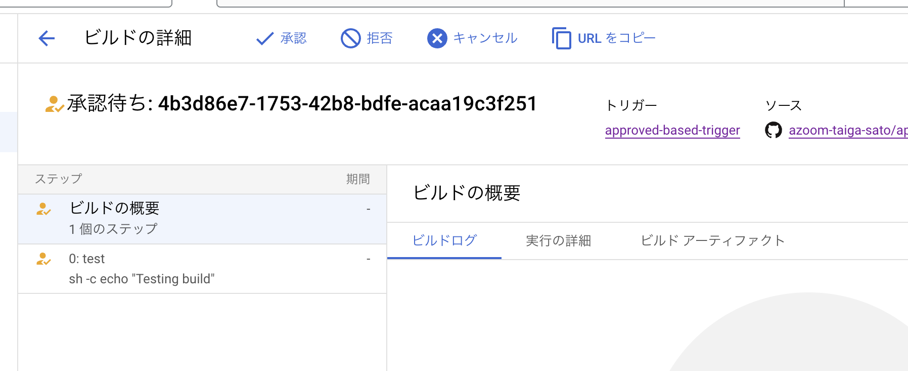

# approved-build-sandbox

1. **Coder:** Code in your own branch

2. **Coder:** Rebase your branch based on the main branch
    ```bash
    $ git checkout main

    $ git pull

    $ git checkout your-branch

    $ git rebase main
    ```

3. **Coder:** Push your commits to the remote repository

4. **Coder:** Create a pull request and ask a reviewer for their review/approval

5. **Reviewer:** Approve the pull request (do **NOT** merge it into the main branch at this point)

6. **Coder:** Update the version, create a new tag in your working branch, and push again
    ```bash
    $ yarn version
    👇
    yarn version v1.22.22
    info Current version: 1.0.3
    question New version: 1.0.4
    info New version: 1.0.4
    ✨  Done in 4.05s.
    ```

7. **Reviewer:** Perform the final check and merge it into the main branch

8. GitHub Actions automatically pushes the new tag to the remote repository along with the PR being merged (pushed), and Cloud Build prepares its build along with the new tag being pushed.
    * Tag is created based on `package.json`. (e.g., 1.1.0 => v1.1.0)
    * Authorization is required to start the build process in the Cloud Build setting.

9. **Reviewer:** Go to Cloud Build and approve the prepared build
